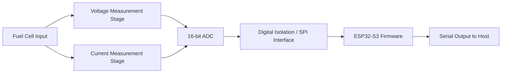

# Project Seminar SS2025 — Fuel Cell Monitoring Board


A mixed-signal hardware and firmware project for monitoring fuel-cell voltage and current using a custom KiCad PCB, precision analog front-end, isolated SPI data path, 16-bit ADC acquisition, and ESP32-S3 based data processing.

This repository combines the complete PCB design files and embedded firmware developed for the **Project Seminar SS2025**. The board is intended to acquire fuel-cell electrical measurements, convert raw ADC data into physical voltage/current values, and stream the processed measurements to a host system over serial communication.

---

## Repository Description

**Short GitHub description:**

> KiCad + ESP32-S3 fuel-cell monitoring board with precision voltage/current sensing, 16-bit SPI ADC acquisition, digital isolation, and PlatformIO firmware for averaged serial data output.

---

## Project Overview

The project focuses on designing and implementing a fuel-cell monitoring board that can measure:

- Fuel-cell voltage
- Fuel-cell current
- ADC raw measurement values
- Averaged and calibrated output data

The system is built around a modular PCB design with separate schematic blocks for power, voltage measurement, current measurement, ADC conversion, data transmission, and microcontroller-side processing.



---

## Key Features

- Custom PCB designed in **KiCad**
- Modular schematic structure for easier debugging and documentation
- Fuel-cell voltage sensing using a resistor divider and analog signal conditioning
- Fuel-cell current sensing using a shunt resistor and current-sense amplifier stage
- Precision voltage reference for ADC conversion
- SPI-based ADC communication
- Digital isolation for safer data transmission between analog and digital domains
- ESP32-S3 firmware using **PlatformIO** and the **Arduino framework**
- Timer-based sampling and averaging for stable readings
- Serial output in a simple host-readable format

---

## Hardware Architecture

| Block | Purpose | Related Files |
|---|---|---|
| Main KiCad Project | Central project configuration | `Project_Seminar_SS2025.kicad_pro` |
| PCB Layout | Physical board layout | `Project_Seminar_SS2025.kicad_pcb` |
| Root Schematic | Top-level schematic project | `Project_Seminar_SS2025.kicad_sch` |
| Power Supply | Power regulation and supply rails | `power.kicad_sch` |
| Voltage Measurement | Fuel-cell voltage sensing stage | `voltage_measure.kicad_sch`, `voltage_mea.kicad_sch` |
| Current Measurement | Shunt/current-sense stage | `current_measure.kicad_sch` |
| ADC Stage | ADC interface and analog conversion | `adc.kicad_sch`, `ADC_Main.kicad_sch` |
| Data Transmission | Isolated SPI / digital communication | `Data_Transmission_Main.kicad_sch` |
| Custom Symbols | Project-specific schematic symbols | `KiCad_Board_Design/MySymbols/` |
| Custom Footprints | Project-specific PCB footprints | `KiCad_Board_Design/MyFootprints/` |
| ERC Report | Electrical rules check output | `ERC.rpt` |

---

## Main Components Used

The design includes footprints/symbols for several important mixed-signal and embedded components, including:

- **ESP32-S3 DevKitC-1** — microcontroller and firmware execution platform
- **LTC2368IMS-16** — 16-bit ADC interface stage
- **LTC6655 4.096 V reference** — precision ADC reference
- **AD8410** — current-sense amplifier stage
- **LT6202** — analog signal conditioning / amplifier stage
- **ADuM4150BRIZ** — digital isolator for SPI communication
- **LT1761 / LT1762** — low-noise voltage regulators
- Custom connectors, jumpers, shunt resistor, and measurement terminals

---

## Firmware Overview

Firmware is located in:

```text
Board_Software/Fuel_Cell/
```

The ESP32-S3 firmware performs the following tasks:

1. Initializes serial communication at `115200 baud`
2. Configures SPI pins for ADC communication
3. Uses a hardware timer for periodic acquisition
4. Reads two 16-bit ADC channels from a 32-bit SPI transfer
5. Averages multiple samples for smoother measurements
6. Converts raw ADC values into voltage and current
7. Sends formatted readings to the host PC

### Firmware Pin Mapping

| Signal | ESP32-S3 Pin |
|---|---:|
| MOSI | GPIO 11 |
| MISO | GPIO 13 |
| SCK | GPIO 12 |
| SS / CS | GPIO 10 |
| CNV | GPIO 14 |
| BUSY | GPIO 9 |

### Serial Output Format

The firmware prints measurements in the following format:

```text
V:12.345,I:1.234
```

Where:

- `V` = calculated fuel-cell voltage in volts
- `I` = calculated fuel-cell current in amperes

---

## Measurement Conversion Logic

The firmware uses a 4.096 V ADC reference and 16-bit conversion range.

### Voltage Conversion

```cpp
adcInputVoltage = (rawValue / 65535.0) * 4.096;
fuelCellVoltage = adcInputVoltage * dividerRatio;
```

The voltage divider ratio is calculated from:

```cpp
R_TOTAL = 39000 + 2000;
R_BOTTOM = 3900 + 100;
dividerRatio = R_TOTAL / R_BOTTOM;
```

### Current Conversion

```cpp
senseAmpOutputVoltage = (rawValue / 65535.0) * 4.096;
shuntVoltage = senseAmpOutputVoltage / 20.0;
fuelCellCurrent = shuntVoltage / 0.008;
```

The current calculation depends on:

- Sense amplifier gain: `20`
- Shunt resistance used in firmware: `0.008 Ω`

> Update these constants if the final measured resistor values or amplifier gain differ from the prototype assumptions.

---

## Getting Started

### 1. Clone the Repository

```bash
git clone https://github.com/<your-username>/<your-repo-name>.git
cd <your-repo-name>
```

### 2. Open the PCB Design

Open the project file in KiCad:

```text
Project_Seminar_SS2025.kicad_pro
```

Recommended KiCad workflow:

1. Open the project in KiCad
2. Review the schematic hierarchy
3. Run ERC from the schematic editor
4. Open the PCB layout
5. Run DRC before manufacturing
6. Generate Gerber/drill files if the board is ready for fabrication

---

## Building and Uploading Firmware

### Prerequisites

Install:

- Visual Studio Code
- PlatformIO extension
- ESP32-S3 board support through PlatformIO
- USB driver for the ESP32-S3 board, if required

### Build Firmware

```bash
cd Board_Software/Fuel_Cell
pio run
```

### Upload Firmware

```bash
pio run --target upload
```

### Open Serial Monitor

```bash
pio device monitor -b 115200
```

Expected output:

```text
Fuel Cell Monitoring Board - Initializing...
Initialization Complete. Starting Data Acquisition.
V:12.345,I:1.234
```

---

## Repository Structure

```text
Project_Seminar_SS2025/
├── Project_Seminar_SS2025.kicad_pro       # Main KiCad project
├── Project_Seminar_SS2025.kicad_sch       # Top-level schematic
├── Project_Seminar_SS2025.kicad_pcb       # PCB layout
├── power.kicad_sch                        # Power supply design
├── current_measure.kicad_sch              # Current measurement circuit
├── voltage_measure.kicad_sch              # Voltage reference / measurement circuit
├── adc.kicad_sch                          # ADC schematic block
├── Data_Transmission_Main.kicad_sch       # Data transmission / isolation block
├── KiCad_Board_Design/
│   ├── MySymbols/                         # Custom KiCad symbols
│   └── MyFootprints/                      # Custom KiCad footprints
└── Board_Software/
    └── Fuel_Cell/
        ├── platformio.ini                 # PlatformIO configuration
        └── src/
            └── main.cpp                   # ESP32-S3 firmware
```

---

## Suggested GitHub Topics

Use these topics on GitHub to make the project easier to discover:

```text
kicad
pcb-design
esp32-s3
platformio
embedded-systems
fuel-cell
adc
spi
current-sensing
voltage-measurement
mixed-signal
arduino-framework
```

---

## Recommended Cleanup Before Publishing

Before pushing to GitHub, avoid committing generated or temporary files such as:

```text
.pio/
build/
*.bin
*.elf
*.map
*.o
*.d
*.bak
*.lck
Project_Seminar_SS2025-backups/
```

A cleaner repository will be smaller, easier to clone, and more professional for reviewers.

---

## Future Improvements

- Add calibration procedure for voltage and current measurements
- Add CSV logging or USB serial data parser on the host side
- Add OLED/display support for live local readings
- Add wireless transmission using Wi-Fi or BLE
- Add automated firmware tests for conversion functions
- Add final board render, schematic screenshots, and measurement results
- Generate Gerber files and attach manufacturing notes

---

## Author

**Anshaj Malhotra**  
M.Eng. Electrical and Information Engineering  
Hochschule Wismar

---

## License

No license has been selected yet. If this project is intended to be open-source, add a license such as MIT, Apache-2.0, or CERN-OHL depending on how you want others to use the hardware and software design.
